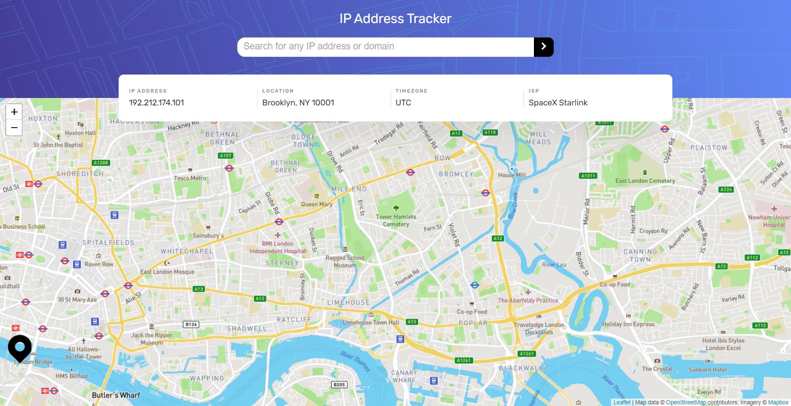

# Frontend Mentor - IP address tracker solution

This is a solution to the [IP address tracker challenge on Frontend Mentor](https://www.frontendmentor.io/challenges/ip-address-tracker-I8-0yYAH0). Frontend Mentor challenges help you improve your coding skills by building realistic projects. 

## Table of contents

- [Overview](#overview)
  - [The challenge](#the-challenge)
  - [Screenshot](#screenshot)
  - [Links](#links)
- [My process](#my-process)
  - [Built with](#built-with)
  - [What I learned](#what-i-learned)
  - [Continued development](#continued-development)
  - [Useful resources](#useful-resources)
- [Author](#author)
- [Acknowledgments](#acknowledgments)

**Note: Delete this note and update the table of contents based on what sections you keep.**

## Overview

### The challenge

Users should be able to:

- View the optimal layout for each page depending on their device's screen size
- See hover states for all interactive elements on the page
- See their own IP address on the map on the initial page load
- Search for any IP addresses or domains and see the key information and location

### Screenshot



### Links

- Live Site URL: [Add live site URL here](https://determined-meitner-cdfc2e.netlify.app/)

## My process

### Built with

- Semantic HTML5 markup
- CSS custom properties
- Flexbox
- CSS Grid
- Mobile-first workflow
- [javascript](https://javascript.org/) - JS library


### What I learned

Use this section to recap over some of your major learnings while working through this project. Writing these out and providing code samples of areas you want to highlight is a great way to reinforce your own knowledge.

To see how you can add code snippets, see below:

```
```js
L.tileLayer('https://api.mapbox.com/styles/v1/{id}/tiles/{z}/{x}/{y}?access_token=pk.eyJ1IjoibWF0aWFzMTk5OTE2IiwiYSI6ImNrdW45cjUyZDJoOXIzMHJ1NnA1aG9kMGQifQ.-5OIRNWig1I_uAOkRiwwYQ', {
    attribution: 'Map data &copy; <a href="https://www.openstreetmap.org/copyright">OpenStreetMap</a> contributors, Imagery © <a href="https://www.mapbox.com/">Mapbox</a>',
    maxZoom: 18,
    id: 'mapbox/streets-v11',
    tileSize: 512,
    zoomOffset: -1,
    accessToken: 'your.mapbox.access.token'
}).addTo(mymap);
```

